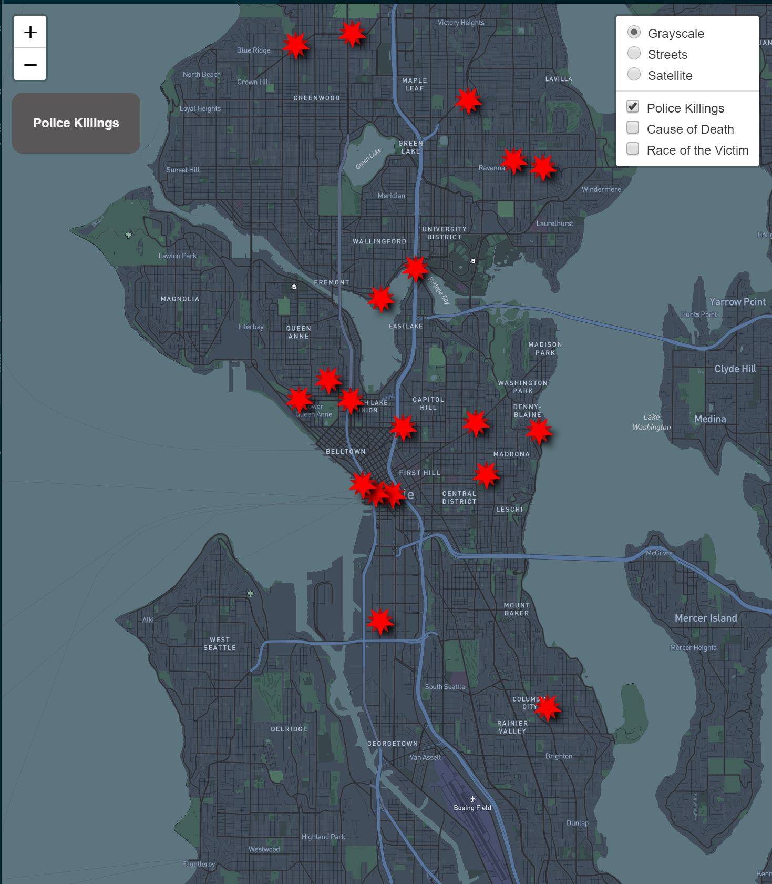

# Mapping-Police-Violence-in-Seattle

## Project Description
This web map features data from law enforcement agencies around the state, and shows the number of police killings in the Pacific Northwest from January 2013 to March 2021. The first map shows the locations of the killings, the second map shows the cause of death for each killing, and the last map shows the race of the victims.

Link to web app: (https://ramouj.github.io/Mapping-Police-Violence-in-Seattle/)

## Project Goals
Through this web map, I hope to inform people about police violence in Seattle starting from 2013 to now. I will regularly update this web map every few months and highlight new and interesting trends I discover through my analysis. My goal is to bring awareness to police violence as it occurs in cities  all around the state, and help vulnerable populations visualize spaces that may not be accepting of them due to their race or identity. I hope to futher develop this project by including other widgets, figures, and tables that can better summarize the data.

## Data sources
I obtained the data from <em>mappingpoliceviolence.org</em> which was last updated on February 27th. The organization meticulously sourced the data from 3 of the largest crowdsourced databases on police killings in the country. They've also cross-referenced and verified the data through social media, obituaries, criminal records, police records, and other sources to verify the races of over 90% of all victims in the database. You can find a link to the database here! https://mappingpoliceviolence.org/)

## Applied libraries 
For this analysis, I used Leaflet to create the webmap application and Map Box Studios to create the basemaps. I then used QGIS to create my map tiles and GitHub to host my application.

## Acknowledgment
I would like to thank Bo Zhao and Tyler McCrea for instructing and facilitating the Geog 458 course at the University of Washington where I obtained the skills to create this web map.
